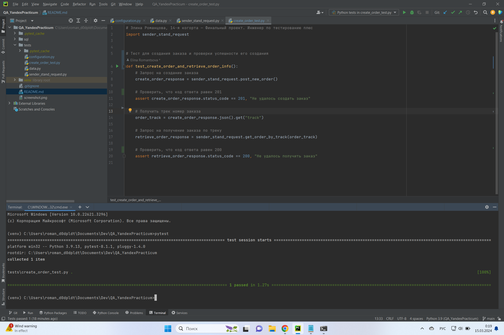

# Практический блок: вторая часть

## Работа с базой данных
### Задание 1

Список логинов курьеров с количеством их заказов в статусе «В доставке» - 
[Решение](sql/task_1.sql)

### Задание 2

Трекеры заказов и их статусы - 
[Решение](sql/task_2.sql)

## Автоматизация теста к API

Файлы с автотестами [здесь](tests)

